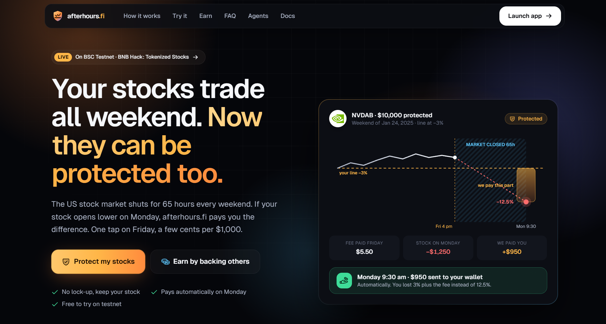

# afterhours.fi - weekend floors for tokenized stocks

<p align="center">
  <a href="https://www.youtube.com/watch?v=xkc_5tCGtk8" target="_blank" rel="noopener noreferrer" title="Watch the afterhours.fi demo on YouTube">
    
  </a>
  <br>
  <a href="https://www.youtube.com/watch?v=xkc_5tCGtk8" target="_blank" rel="noopener noreferrer"><b>▶ Watch the demo on YouTube</b></a>
</p>

**Live app:** https://www.afterhoursfi.xyz · **Agents demo:** https://www.afterhoursfi.xyz/agents · **API:** https://afterhours-fi.onrender.com/api/health · **Kip's agent:** https://afterhours-kip.onrender.com

The US market closes Friday at 4pm New York and reopens Monday at 9:30. Tokenized stocks (bStocks, Ondo) keep trading through the weekend on BNB Chain, priced off a reference that has not moved. afterhours.fi lets a holder set a **floor** under that weekend for a few basis points, and lets a **Keeper pool** earn those premiums for carrying the risk, fully collateralised and CPPI-sized.

> **Methodology, research and intuition** are written up at **[afterhoursfi.xyz/docs](https://www.afterhoursfi.xyz/docs)**: how the idea came about, the market research, the history of bad weekends, the two-sided model, the backtest with real numbers and charts, and what it concludes for both sides. Start there if you are curious about the *why*; this README covers the *how*.

| folder | what |
|---|---|
| `backtest/` | the research: 61,815 ticker-weekends 2005-2026, four pricing engines, Hermee (buyer) and Kip (Keeper) case studies, principal-protection structures, market research, literature, hackathon strategy. Start with `backtest/CONCLUSIONS.md` and `backtest/report/index.html`. |
| `contracts/` | Hardhat project: `KeeperVault` (ERC-4626, CPPI floor), `CoverMarket` (EIP-712 signed quotes, Friday bell, Monday-open settlement, 20% payout cap, `coverFor` for agents), `ReferenceOracle`, test tokens. Deployed on BSC Testnet (home) and Ethereum Sepolia. |
| `server/` | Node + TypeScript + Express + MongoDB: the v4 pricing engine (pooled vol-scaled tail), quote signing, Binance market-status and price feeds, event indexer, Friday/Monday epoch jobs, admin routes. Ships precompiled in `server/dist/`. |
| `client/` | Next.js + wagmi + viem + RainbowKit: landing page, the app (Protect / Earn / My activity / Agents) and `/docs`. Dark, calm, gamified-not-gambling. |
| `agents/` | Two AI agents that trade cover over x402: `kip` (underwriter, BNB Agent Studio, ERC-8004) and `hermee` (buyer, Binance Agentic Wallet on mainnet). See [Agents](#agents-two-ai-agents-trade-weekend-cover). |
| `skills/` | `afterhours-weekend-cover`, the Binance Agentic Wallet skill. |
| `shared/` | `INTERFACE.md` (the contract between the apps), exported ABIs, and the shared x402 and Hermee agent code. |

## Quick start
```powershell
# contracts (already deployed to Sepolia; see contracts/deployments/sepolia.json)
cd contracts; npm install; npm test

# server
cd ../server; npm install; copy .env.example .env   # fill MONGODB_URI, QUOTER_PRIVATE_KEY (= deployer key for now), ADMIN_SECRET, ALCHEMY_API_KEY
npm run dev                                          # http://localhost:4000/api/health

# client
cd ../client; npm install; copy .env.example .env.local   # fill NEXT_PUBLIC_WALLETCONNECT_PROJECT_ID, NEXT_PUBLIC_ALCHEMY_API_KEY
npm run dev                                          # http://localhost:3000
```
The client also runs with no server and no deployment: every server call has a 5s timeout and a static backtest fallback.

## Hosting
- **Client → Vercel** (`afterhoursfi`, root directory `client`). Every push to `main` deploys production. Env: `NEXT_PUBLIC_API_URL` (the Render URL). The navbar "Testnet" switch picks the network (BNB Chain mainnet by default). `NEXT_PUBLIC_*` values are baked in at build time, so change them and redeploy.
- **Server → Render** web service. Build `npm ci --omit=dev`, start `node dist/index.js`, health check `/health`. The server is committed precompiled, so after changing anything in `server/src` run `npm run build` in `server/` and commit `server/dist/` in the same commit.
- **Kip's agent → Render** (`afterhours-kip`, root `agents/kip/app/agent`). It ships as one prebuilt bundle (`npm run bundle`, commit `bundle/kip.mjs`), so Render runs `node bundle/kip.mjs` with no install or build. The keystore comes from `WALLET_KEYSTORE_JSON` + `WALLET_PASSWORD`.
- **Keep-alive.** Render's free tier sleeps after 15 idle minutes, which would pause the indexer, the Friday/Monday jobs and Kip's keeper. An uptime pinger (cron-job.org) hits `GET /health` on both services every 10 minutes: `https://afterhours-fi.onrender.com/health` and `https://afterhours-kip.onrender.com/health`. Neither route touches a DB or RPC.

## Agents: two AI agents trade weekend cover

> **Try it:** [afterhoursfi.xyz/agents](https://www.afterhoursfi.xyz/agents). Press **Start the agents** to watch a real trade between the two agents on BSC Testnet, with every step linked on BscScan.

### In plain words
Buying weekend protection by hand means remembering to do it before 4pm New York every Friday. That is exactly the kind of chore an AI agent should do. So afterhours.fi has **two agents that trade with each other**:

- **Hermee's agent** works for a stock holder. Every Friday it looks at what she holds, asks for a price, checks the price against the budget she set, and pays.
- **Kip's agent** works for the protection pool. It prices the risk, collects the fee, writes the policy on-chain and, on Monday, settles it.

They pay each other with **x402**, a standard that lets one piece of software pay another over the web the way a browser loads a page: ask, get told the price, pay with a signature, get the goods.

**One weekend in numbers (a real trade from the live demo):**
1. Friday: Hermee's agent asks Kip's agent to protect **$1,000 of NVDA** below **-5%**.
2. Kip's agent answers "that costs **$0.16**" (1.6 basis points, priced from 21 years of weekends).
3. Hermee's budget allows up to 1% ($10), so her agent signs one payment. Kip's agent collects it and writes **policy #0** on-chain, in Hermee's name.
4. Monday: if NVDA opens at -8%, the pool pays Hermee **$30** (the 3% below her floor), straight to her wallet. If it opens anywhere above -5%, nothing happens and the $0.16 was the cost of sleeping well.

Kip's agent never holds a payout. It only passes the fee into the pool, and the pool pays Hermee by rule.

### What each piece is

| Term | What it means here |
|---|---|
| **Agent** | A program that acts on someone's behalf with its own wallet: it decides, pays and signs within limits its owner set. |
| **x402** | The HTTP "402 Payment Required" status turned into a real payment standard (v2). The seller answers a request with a price in a `PAYMENT-REQUIRED` header; the buyer retries with a `PAYMENT-SIGNATURE` header; the seller settles the payment on-chain, does the work and returns a `PAYMENT-RESPONSE` receipt. |
| **Binance Agentic Wallet** and **Wallet Skills** | Binance's wallet built for AI agents. The key is held by Binance (MPC) and never given to the agent; spending limits and allowed tokens are set by the human in the Binance App. Agents drive it with the `baw` CLI and "skills" (instruction packs). Hermee's agent pays with `baw x402-payment preview` / `sign`. **Mainnet only.** |
| **BNB Agent Studio** | BNB Chain's toolkit for "seller" agents (`bag` CLI): scaffolds the agent, gives it a wallet it alone controls, an on-chain identity, an MCP server and payment rails. Kip's agent is built with it. |
| **ERC-8004** | An on-chain registry of agent identities. Kip's agent is **agent #2530** on BSC Testnet, pointing at its public agent card, so any other agent can look up who it is and how to reach it. |
| **MCP** | Model Context Protocol, the standard way AI agents call tools. Kip's agent offers free tools (`quote_cover`, `market_status`, `gap_history`, `pool_health`, `my_book`) any agent can use to check weekend risk. |
| **A2A agent card** | A small public JSON file describing the agent and its skills: [`/.well-known/agent-card.json`](https://afterhours-kip.onrender.com/.well-known/agent-card.json). |
| **Permit2** | A standard contract that lets a wallet authorise one exact token transfer with a signature instead of a transaction. x402 uses it on BNB Chain because USDT has no built-in signed transfers. |
| **Facilitator** | The service that checks an x402 payment and submits it on-chain, paying the gas. On mainnet that is Binance's **b402**. On testnet afterhours.fi runs a stand-in with the same API (see below). |
| **Binder / `coverFor`** | A new CoverMarket function: an agent the market owner has authorised (a "binder") can write a policy **for** a buyer after collecting the fee off-chain. The policy, payouts and refunds all stay the buyer's. |

### One trade, step by step

```
Hermee's agent                 Kip's agent                 Facilitator             BNB Chain
     | 1. POST /cover/bind  ------->|                            |                      |
     |<------- 2. 402 + price ------|                            |                      |
     | 3. check budget, sign once   |                            |                      |
     | 4. retry + PAYMENT-SIGNATURE>|                            |                      |
     |                              | 5. verify + settle ------->| 6. USDT Hermee -> Kip|
     |                              | 7. coverFor(quote) ------------------------------>| policy for Hermee,
     |<-- 8. 200 + policy + tx ids -|                            |                      | fee -> pool
   Monday:                          | 9. settleBatch ---------------------------------->| pool pays Hermee
```

On-chain that is three kinds of transactions: a one-time Permit2 approval by Hermee, the x402 settlement (through the standard `x402ExactPermit2Proxy`), and Kip's `coverFor`. Then on Monday, Kip's `settleBatch`.

### Who can move what
- **Hermee's signature fixes the recipient and the amount.** The payment can only go to Kip's address, for the quoted fee, before a deadline. The facilitator only pays gas and cannot redirect it.
- **Hermee's agent refuses bad offers.** It won't pay above its budget, won't pay a different amount, token, network or recipient than offered, asks before signing when a person is in the loop, and retries at most once. On mainnet, the Agentic Wallet also enforces the owner's own daily limit.
- **Kip's agent cannot pick the buyer.** Each quote is signed by the pricing engine for a specific buyer, and the contract checks that buyer really holds the stock. Kip cannot re-point a quote at itself.
- **Kip's agent never touches payouts.** Payouts and refunds go from the pool to the buyer. If binding fails after Kip was paid, Kip refunds the fee before answering.
- **Nothing that moves money is an AI decision.** Kip signs with fixed code using its Studio key; its LLM-facing tools are read-only. The market owner can revoke Kip's binder permission at any time.

### Testnet today, mainnet by configuration
Two parts of the stack have no public testnet: the **Binance Agentic Wallet** (BSC, Base and Solana mainnets only) and **b402** (BSC testnet only inside Binance's internal QA environment). So on BSC Testnet:

| Piece | BSC Testnet (live now) | BSC Mainnet (same code) |
|---|---|---|
| Hermee's wallet | a local test key signs the **identical** x402 payment | Binance Agentic Wallet, `HERMEE_WALLET=baw` |
| Facilitator | afterhours.fi stand-in (`server/src/x402/facilitator.ts`), same verify/settle API, only settles our marketplace's payments | Binance b402, `X402_FACILITATOR_URL` |
| Kip's agent | Agent Studio, `network = bsc-testnet` | Agent Studio, `AFTERHOURS_CHAIN_ID=56` |
| Payment contracts | Permit2 `0x000000000022D473030F116dDEE9F6B43aC78BA3`, proxy `0x402085c248EeA27D92E8b30b2C58ed07f9E20001` | the same contracts at the same addresses |

### Try it
1. **In the browser:** [afterhoursfi.xyz/agents](https://www.afterhoursfi.xyz/agents). Pick a stock, amount and floor, then press **Start the agents**. The server runs Hermee's agent against Kip's live agent and streams each step.
2. **From the command line** (your own testnet key):
   ```bash
   cd agents/hermee && npm install
   echo "HERMEE_PRIVATE_KEY=0x<throwaway testnet key with a little tBNB>" > .env
   export KIP_AGENT_URL=https://afterhours-kip.onrender.com
   npm run hermee -- quote   --token NVDAB --amount 1000 --floor 5   # free, over MCP
   npm run hermee -- protect --token NVDAB --amount 1000 --floor 5   # pays over x402, asks y/N first
   ```
3. **As another agent:** call Kip's MCP tools at `https://afterhours-kip.onrender.com/mcp`, or follow the raw x402 exchange in [`skills/afterhours-weekend-cover/references/x402-cover-flow.md`](skills/afterhours-weekend-cover/references/x402-cover-flow.md).
4. **With the Binance Agentic Wallet (mainnet):** install the skill in [`skills/afterhours-weekend-cover`](skills/afterhours-weekend-cover/SKILL.md). It tells the agent exactly which `baw` commands to run and which guardrails to keep.

### Proof on BSC Testnet

| Policy | Trade | x402 payment (Hermee → Kip) | Policy bound by Kip |
|---|---|---|---|
| #0 | $1,000 NVDA below -5% for $0.16, from the CLI | [`0x45463fbb…`](https://testnet.bscscan.com/tx/0x45463fbb8701ff88564de27e8d819434af78cb981d78b652b86870fd61483c07) | [`0x34e252d8…`](https://testnet.bscscan.com/tx/0x34e252d8a686cc2073c95fcecad00ea86d6e7cc67a64366298ebbb05aa695f74) |
| #1 | $1,000 NVDA below -5% for $0.16, from the live server | [`0x59008f37…`](https://testnet.bscscan.com/tx/0x59008f375034947b528d27436f4d730bfdcca275b2e687f5514f4dd9836d7649) | [`0x63eb4c39…`](https://testnet.bscscan.com/tx/0x63eb4c391c1310ff74250858cbf2677ec3c0b27603ff2e42e978c62eba70fc10) |
| #2 | $1,000 TSLA below -5% for $0.44, from the website | [`0x79498ec0…`](https://testnet.bscscan.com/tx/0x79498ec09f9e54c3021fb9a3d69315aa9c39747c6986b23b9b5fbbf49216983e) | [`0x72df0a07…`](https://testnet.bscscan.com/tx/0x72df0a07c6f4eaba362213914d50021e9293a528e997c684b11b4630255ce149) |

- Hermee's agent: [`0x7bc4Db58435b586C16a11cB477C257433349844A`](https://testnet.bscscan.com/address/0x7bc4Db58435b586C16a11cB477C257433349844A)
- Kip's agent: [`0x6513a00FB8341ee24Af029EFAf67B19b5914ed4C`](https://testnet.bscscan.com/address/0x6513a00FB8341ee24Af029EFAf67B19b5914ed4C), ERC-8004 agent #2530 in registry [`0x8004A818BFB912233c491871b3d84c89A494BD9e`](https://testnet.bscscan.com/address/0x8004A818BFB912233c491871b3d84c89A494BD9e)

These policies belong to the weekend closing Friday 2 October 2026. Kip's agent settles them at the Monday open on 5 October.

### Where the code lives

| Path | What |
|---|---|
| `agents/kip/` | Kip's agent, scaffolded with Agent Studio. afterhours.fi logic is in `app/agent/src/afterhours/`: the x402 seller route, MCP tools, keeper loop and fixed-code signing. It ships as `app/agent/bundle/kip.mjs`. |
| `agents/hermee/` | Hermee's agent CLI: `status`, `quote` (MCP), `protect` (x402). Payers: `bawPayer.ts` for the Agentic Wallet, and the local testnet key. |
| `shared/hermee/` | The buyer flow and guardrails, shared by the CLI, the server's live demo and the website. |
| `shared/x402/` | x402 v2 exact/Permit2: headers, the signed payload, and the facilitator's seven checks. Used everywhere. |
| `server/src/x402/`, `server/src/routes/x402.ts`, `server/src/routes/agentsDemo.ts` | The testnet facilitator, the agent activity feed, and the streaming live demo. |
| `contracts/contracts/CoverMarket.sol` | `coverFor` and `setBinder` (5 dedicated tests). |
| `skills/afterhours-weekend-cover/` | The Binance Agentic Wallet skill (`SKILL.md` and references). |
| `client/src/components/agents/` | The `/agents` page. |

## Deployments
**BSC Testnet is the home network**: the app connects to it by default. Ethereum Sepolia runs the same stack. The deployer `0x1d83F122EF31885B83139ABCb4f8fB4eF319DDF9` is owner, admin and quoter on both.

| contract | BSC Testnet (97) | Ethereum Sepolia (11155111) |
|---|---|---|
| Protection market | [`0xDF7DE17d60876a32b902dc4f4698633C7d849e1f`](https://testnet.bscscan.com/address/0xDF7DE17d60876a32b902dc4f4698633C7d849e1f) | [`0x8f80d31BaF2AbFC91fF4837107871Ed0930B091C`](https://sepolia.etherscan.io/address/0x8f80d31BaF2AbFC91fF4837107871Ed0930B091C) |
| Protection pool (kUSDT) | [`0x721380dc07a44f6B783825aCecb0b626F8177275`](https://testnet.bscscan.com/address/0x721380dc07a44f6B783825aCecb0b626F8177275) | [`0x3eD15ce2936909016D6767d9D109D839E4E40B52`](https://sepolia.etherscan.io/address/0x3eD15ce2936909016D6767d9D109D839E4E40B52) |
| Price oracle | [`0x3Db10b1c68B09803b19bd7fc538C848C20158701`](https://testnet.bscscan.com/address/0x3Db10b1c68B09803b19bd7fc538C848C20158701) | [`0x0fC24edC4A70A37E8EB5f953132550696d9F18fB`](https://sepolia.etherscan.io/address/0x0fC24edC4A70A37E8EB5f953132550696d9F18fB) |
| Test USDT (6 decimals) | [`0x029bcCb1dfeAc2f846D43a9ca318C18083EEf108`](https://testnet.bscscan.com/address/0x029bcCb1dfeAc2f846D43a9ca318C18083EEf108) | [`0x4513E017E0C77D82e920DAEDD47F653510Bb52c5`](https://sepolia.etherscan.io/address/0x4513E017E0C77D82e920DAEDD47F653510Bb52c5) |
| NVDAB · bStock NVDA (test) | [`0x05C366016264E82dA6b4582e0554Be8568C8dE36`](https://testnet.bscscan.com/address/0x05C366016264E82dA6b4582e0554Be8568C8dE36) | [`0x7832f47D5b13255d5F745F83837Bd4ffA8f2a9F4`](https://sepolia.etherscan.io/address/0x7832f47D5b13255d5F745F83837Bd4ffA8f2a9F4) |
| TSLAB · bStock TSLA (test) | [`0xf37b92a7dD0824D0A1b1Fb761A380E0065Fc8Cf1`](https://testnet.bscscan.com/address/0xf37b92a7dD0824D0A1b1Fb761A380E0065Fc8Cf1) | [`0x519F2841905FB4c3e6Cf4D7D4FE0793dBcf4b602`](https://sepolia.etherscan.io/address/0x519F2841905FB4c3e6Cf4D7D4FE0793dBcf4b602) |
| AAPLB · bStock AAPL (test) | [`0xb737520d65DC1a8D20353f960d2cB4E7E0Fe53f1`](https://testnet.bscscan.com/address/0xb737520d65DC1a8D20353f960d2cB4E7E0Fe53f1) | [`0x90D58a2B63Df22baFd8F6Ae3315D5728aAD9C0d6`](https://sepolia.etherscan.io/address/0x90D58a2B63Df22baFd8F6Ae3315D5728aAD9C0d6) |
| SPYB · bStock SPY (test) | [`0x0fC24edC4A70A37E8EB5f953132550696d9F18fB`](https://testnet.bscscan.com/address/0x0fC24edC4A70A37E8EB5f953132550696d9F18fB) | [`0x02B08180aFC524c7a81C4723E25608957D702c6a`](https://sepolia.etherscan.io/address/0x02B08180aFC524c7a81C4723E25608957D702c6a) |
| COINB · bStock COIN (test) | [`0x3eD15ce2936909016D6767d9D109D839E4E40B52`](https://testnet.bscscan.com/address/0x3eD15ce2936909016D6767d9D109D839E4E40B52) | [`0x029bcCb1dfeAc2f846D43a9ca318C18083EEf108`](https://sepolia.etherscan.io/address/0x029bcCb1dfeAc2f846D43a9ca318C18083EEf108) |
| MSTRB · bStock MSTR (test) | [`0x8f80d31BaF2AbFC91fF4837107871Ed0930B091C`](https://testnet.bscscan.com/address/0x8f80d31BaF2AbFC91fF4837107871Ed0930B091C) | [`0x05C366016264E82dA6b4582e0554Be8568C8dE36`](https://sepolia.etherscan.io/address/0x05C366016264E82dA6b4582e0554Be8568C8dE36) |
| NVDAon · Ondo NVDA (test) | [`0x6a1D6a53D8886c4F94ddc5BBC975ef1B1850B4Ba`](https://testnet.bscscan.com/address/0x6a1D6a53D8886c4F94ddc5BBC975ef1B1850B4Ba) | [`0xf37b92a7dD0824D0A1b1Fb761A380E0065Fc8Cf1`](https://sepolia.etherscan.io/address/0xf37b92a7dD0824D0A1b1Fb761A380E0065Fc8Cf1) |
| SPYon · Ondo SPY (test) | [`0x4597b0f5Ae9fd15f374726C5F916f2F841a38F20`](https://testnet.bscscan.com/address/0x4597b0f5Ae9fd15f374726C5F916f2F841a38F20) | [`0xb737520d65DC1a8D20353f960d2cB4E7E0Fe53f1`](https://sepolia.etherscan.io/address/0xb737520d65DC1a8D20353f960d2cB4E7E0Fe53f1) |

| | BSC Testnet | Ethereum Sepolia |
|---|---|---|
| deploy block | [133,916,239](https://testnet.bscscan.com/block/133916239) | [11,800,197](https://sepolia.etherscan.io/block/11800197) |
| open weekends (epochId) | 1790971200, 1791576000 | 1790971200, 1791576000 |
| authorised binders (agents) | [`0x6513a00FB8341ee24Af029EFAf67B19b5914ed4C`](https://testnet.bscscan.com/address/0x6513a00FB8341ee24Af029EFAf67B19b5914ed4C) | none |

**Agent-to-agent (x402)** on BSC Testnet uses the canonical, chain-independent contracts: Permit2 [`0x000000000022D473030F116dDEE9F6B43aC78BA3`](https://testnet.bscscan.com/address/0x000000000022D473030F116dDEE9F6B43aC78BA3) and x402ExactPermit2Proxy [`0x402085c248EeA27D92E8b30b2C58ed07f9E20001`](https://testnet.bscscan.com/address/0x402085c248EeA27D92E8b30b2C58ed07f9E20001).

Core contracts are source-verified on BscScan and Etherscan. The raw address books are `contracts/deployments/bscTestnet.json` and `contracts/deployments/sepolia.json` (copied into `server/deployments` and `client/src/deployments`).

## How a weekend works
1. **Friday, before the bell.** The holder picks a token and a weekly budget (or a floor). The server prices it with the pooled vol-scaled engine, signs an EIP-712 quote, and the holder calls `buyCover`. The premium goes into the Keeper vault; the vault locks 20% of the notional as the policy's maximum payout.
2. **The bell.** No more purchases (`bindDeadline`). The oracle records the Friday close per share.
3. **Monday, 9:30 New York.** The oracle records the first official opening print. Anyone calls `settle`: payout per $1 = min(max(-barrier - gap, 0), 20%). The holder gets a receipt: "Floor held" or "Floor paid $X". Corporate actions void the weekend and refund the premium.

For the full story in plain numbers (Hermee's weekend, Kip's vault) and the quant methodology behind the pricing, see **[/docs](https://www.afterhoursfi.xyz/docs)**.

## Hackathon disclosure
Testnet only. The deployer address owns every contract and can pause, change parameters, force-settle, correct prices and withdraw funds. Not available in restricted jurisdictions. Built for BNB Hack: Tokenized Stocks Edition.
